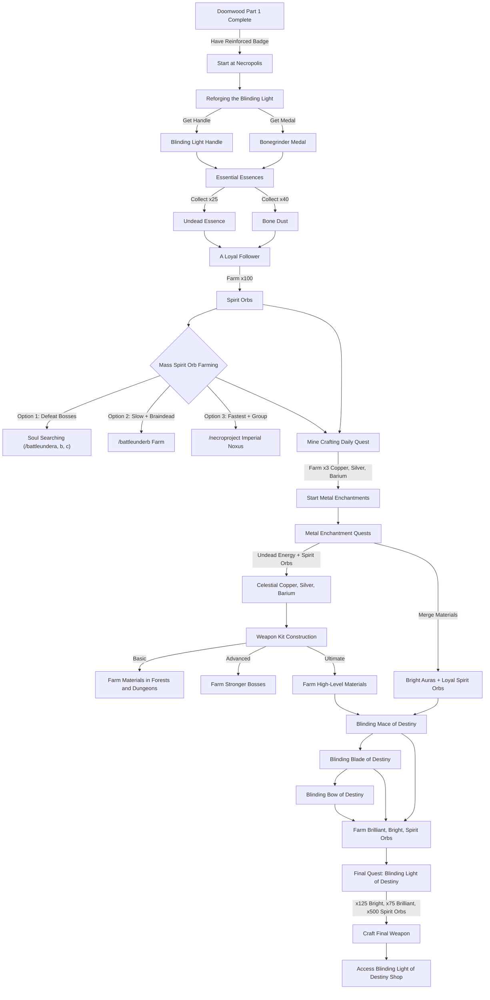

```mermaid
flowchart TD
    A[Doomwood Part 1 Complete] -->|Have Reinforced Badge| B[Start at Necropolis]
    
    B --> C["Reforging the Blinding Light"]
    C -->|Get Handle| D[Blinding Light Handle]
    C -->|Get Medal| E[Bonegrinder Medal]

    D & E --> F["Essential Essences"]
    F -->|Collect x25| G[Undead Essence]
    F -->|Collect x40| H[Bone Dust]
    
    G & H --> I["A Loyal Follower"]
    I -->|Farm x100| J[Spirit Orbs]
    J --> K{Mass Spirit Orb Farming}
    K -->|Option 1: Defeat Bosses| M["Soul Searching (/battleundera, b, c)"]
    K -->|Option 2: Slow + Braindead| N["/battleunderb Farm"]
    K -->|Option 3: Fastest + Group| O["/necroproject Imperial Noxus"]

    J & K --> P["Mine Crafting Daily Quest"]
    P -->|Farm x3 Copper, Silver, Barium| Q[Start Metal Enchantments]

    Q --> R["Metal Enchantment Quests"]
    R -->|Undead Energy + Spirit Orbs| S[Celestial Copper, Silver, Barium]
    R -->|Merge Materials| T[Bright Auras + Loyal Spirit Orbs]

    S --> U["Weapon Kit Construction"]
    U -->|Basic| V[Farm Materials in Forests and Dungeons]
    U -->|Advanced| W[Farm Stronger Bosses]
    U -->|Ultimate| X[Farm High-Level Materials]

    T & X --> Y[Blinding Mace of Destiny]
    Y --> Z["Blinding Blade of Destiny"]
    Z --> AA["Blinding Bow of Destiny"]

    Y & Z & AA --> AB["Farm Brilliant, Bright, Spirit Orbs"]
    AB --> AC["Final Quest: Blinding Light of Destiny"]
    AC -->|x125 Bright, x75 Brilliant, x500 Spirit Orbs| AD[Craft Final Weapon]
    AD --> AE[Access Blinding Light of Destiny Shop]

```

